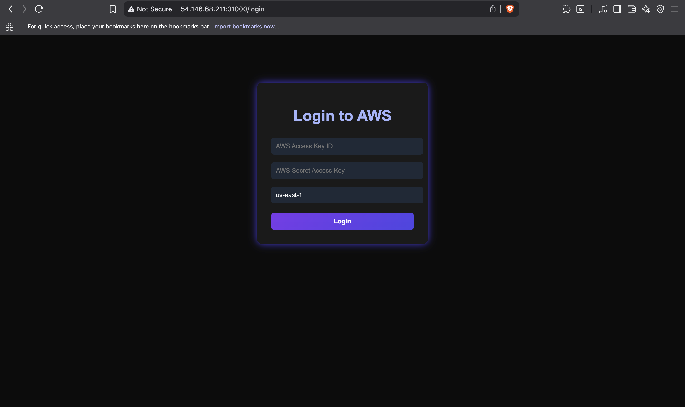
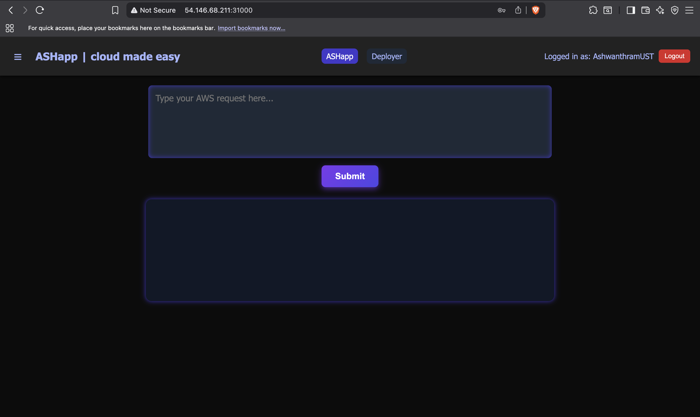
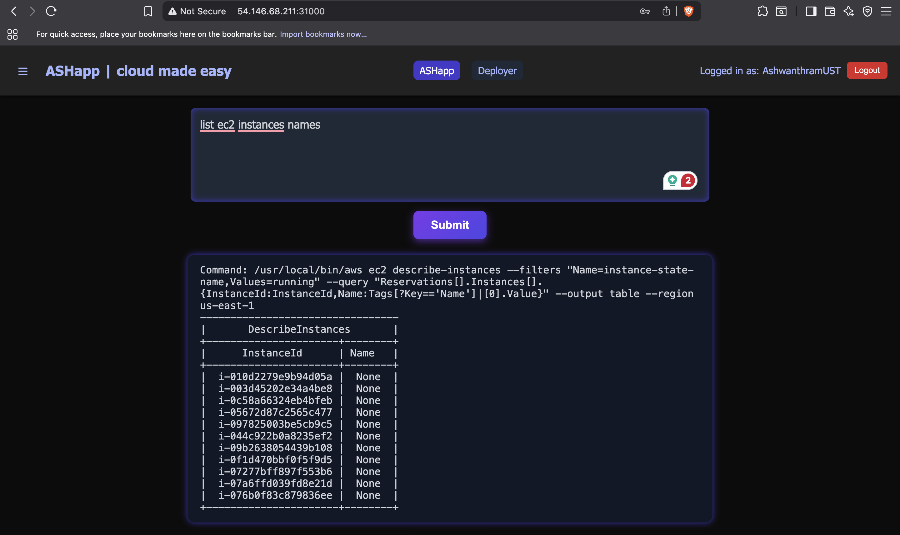
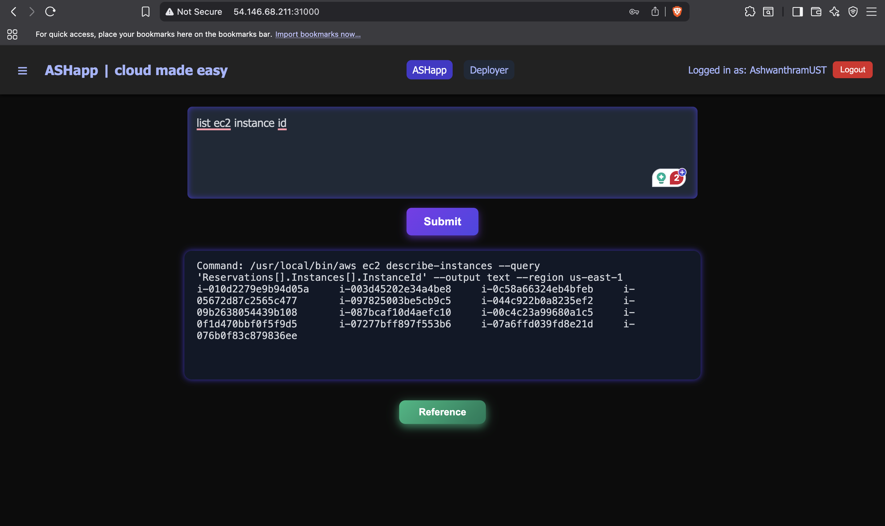

# Project Working Screenshots

Here are some working screenshots of the project:

## Screenshots

### Screenshot 1


### Screenshot 2


### Screenshot 3


### Screenshot 4


### Screenshot 5


# AWS Cloud-Based Microservice Platform

## Project Summary

This project is a cloud-native, containerized microservice platform that enables users to interact with AWS services through a user-friendly web interface. It leverages modern DevOps practices, Kubernetes orchestration, and secure API design to provide a seamless experience for cloud resource management, monitoring, and deployment.

**Key Features:**
- **Web-based UI:** Intuitive frontend for AWS operations and deployment management.
- **User Authentication:** Secure login with AWS credentials.
- **Dynamic AWS CLI Generation:** Converts user queries into valid AWS CLI commands using AI (Amazon Bedrock).
- **Kubernetes Orchestration:** Automated deployment, scaling, and network policies.
- **Service Monitoring:** Logs and tracks user actions and system events.
- **History Tracking:** Maintains a history of user queries and actions.
- **Role-Based Access Control:** Secure service account and RBAC for Kubernetes resources.

---

## High-Level Workflow

1. **User Login:**  
   Users authenticate via a web login page by providing AWS credentials and region.

2. **Query Submission:**  
   Users enter natural language queries (e.g., "Create an S3 bucket") in the web UI.

3. **AI Command Generation:**  
   The backend uses Amazon Bedrock to convert queries into AWS CLI commands.

4. **Command Execution:**  
   The backend securely executes the generated AWS CLI command using the provided credentials.

5. **Confirmation & Monitoring:**  
   For sensitive actions (create, delete, modify), the system asks for user confirmation and logs the action to a monitoring service.

6. **History & Output:**  
   The result and command are displayed to the user and saved in the history service for future reference.

7. **Deployment & Scaling:**  
   The platform is deployed on Kubernetes, with auto-scaling, network policies, and RBAC for security and reliability.

---

## UML Diagram (Textual Representation)

```
+-------------------+        +-------------------+        +-------------------+
|    Web Frontend   |<-----> |     Flask API     |<-----> |   AWS Services    |
| (React, HTML/CSS) |        |   (Python Flask)  |        | (via AWS CLI/SDK) |
+-------------------+        +-------------------+        +-------------------+
         |                           |                            |
         |                           v                            |
         |                +-------------------+                   |
         |                |  Bedrock AI Model |                   |
         |                +-------------------+                   |
         |                           |                            |
         |                           v                            |
         |                +-------------------+                   |
         |                |  History Service  |                   |
         |                +-------------------+                   |
         |                           |                            |
         |                           v                            |
         |                +-------------------+                   |
         |                | Monitoring Service|                   |
         |                +-------------------+                   |
         |                           |                            |
         +---------------------------+----------------------------+
```

---

## Design Diagram of Workflow

1. **User** → **Frontend (React/HTML)**  
   - Enters AWS credentials and queries.

2. **Frontend** → **Flask Backend API**  
   - Sends login and query requests via REST API.

3. **Flask Backend**  
   - Authenticates user.
   - Forwards queries to Bedrock AI for CLI command generation.
   - Executes AWS CLI commands.
   - Logs actions to Monitoring Service.
   - Saves query and output to History Service.
   - Forwards deployment requests to Deployer Service (if needed).

4. **Kubernetes**  
   - Manages deployment, scaling (HPA), network policies, and RBAC for all services.

---

## API & Service Call Overview

### Main API Endpoints

- **POST `/api/login`**  
  Authenticates user with AWS credentials.

- **POST `/api/ask`**  
  Accepts a user query, generates an AWS CLI command using Bedrock, and executes it.  
  - If the action is sensitive (create/delete/modify), asks for confirmation.

- **POST `/api/confirm`**  
  Executes a previously generated command after user confirmation.

- **GET `/api/history`**  
  Returns the user's query and command execution history.

- **POST `/api/deployer`**  
  Forwards deployment requests to the Deployer Service.

- **POST `/monitor/log`**  
  (Internal) Logs user actions and system events for auditing.

### Service Interactions

- **Frontend ↔ Backend:**  
  REST API calls for login, queries, history, and deployment.

- **Backend ↔ Bedrock AI:**  
  Sends user queries for AWS CLI command generation.

- **Backend ↔ AWS Services:**  
  Executes AWS CLI commands using user credentials.

- **Backend ↔ History Service:**  
  Saves and retrieves user query history.

- **Backend ↔ Monitoring Service:**  
  Logs all significant user actions and system events.

- **Backend ↔ Deployer Service:**  
  Forwards deployment-related requests.

- **Kubernetes:**  
  Handles service deployment, scaling, networking, and security.

---

## Kubernetes Architecture

- **Deployment:**  
  Flask app, Deployer, History, and Monitor services are deployed as separate pods.
- **Service:**  
  Exposes Flask app via NodePort for external access.
- **HPA:**  
  Horizontal Pod Autoscaler manages scaling based on CPU utilization.
- **NetworkPolicy:**  
  Restricts ingress/egress for security (e.g., only allow traffic from NGINX ingress, allow egress to AWS, Deployer, Monitor, and History services).
- **RBAC:**  
  ServiceAccount and Role/RoleBinding provide least-privilege access to Kubernetes resources.

---

## How to Use

1. **Deploy the platform on Kubernetes.**
2. **Access the web UI.**
3. **Login with your AWS credentials.**
4. **Submit AWS-related queries in natural language.**
5. **Review, confirm, and execute actions as needed.**
6. **Monitor history and logs for all actions.**

---

## Notes

- No AWS credentials are stored; all actions are session-based and secure.
- The platform is designed for educational and demonstration purposes.
- All service and API interactions are secured and monitored.


